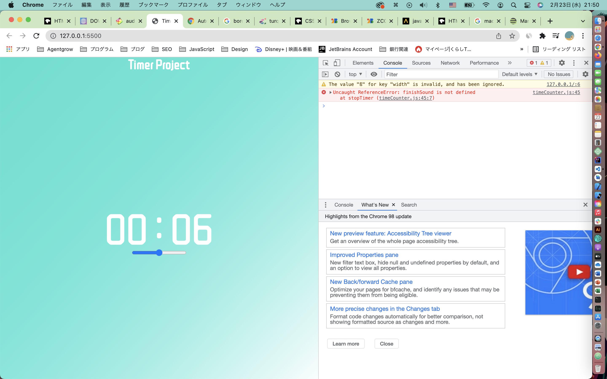

# タイマーアプリ

## 実装項目

### 1. HTML

- タイマーの表示エリア(終了: 2022/2/13)
- スタート・ストップボタンの表示

### 2. CSS

- 第一段階

1. 表示時間のスタイル(終了: 2022/2/23)
2. スタート・ストップボタンのスタイル

- 第二段階

1. 時間が進んでいる時の画面表示スタイル(時計のような感じでわかるようにしたい)

### 3. JavaScript

- 第一段階

1. 1 秒ごとにカウントする(終了: 2022/2/13)
2. 60 秒経ったら、分を＋１する (終了: 2022/2/13)
3. 25 分経ったら終了して、メッセージを出す

- 第二段階

1. スタートボタンが押されてから時間カウントを進める
2. ストップボタンが押されたら、カウントをストップする
3. 25 分経ち、終了したらメッセージと共に音を鳴らす(終了; 2022/2/23)

- 第三段階

1. 25 分の計測サイクルを 3 回繰り返すことができるようにする
2. 終了時の音の種類を選択できるようにする
3. 終了音の音量調節をできるようにする（追記:2022/2/23)

---

## 実装中課題(都度メモ)

課題 1 : JavaScript 第一段階

mm と ss を保持しておく変数をどこで作り、管理するか  
(カウントする関数でカウントアップをしようとすると mm と ss の 2 つの戻り値を返す必要が出るので避けたい)

->解決: グローバル変数として保持して実装した後に、全体を function で囲うことでグローバル変数を回避しながら実装成功

---

## 宿題

宿題 1(2022/02/13): setInterval で呼び出す関数の指定の際に、なぜ関数の後ろに()をつけると 1 回しか呼び出されないのか調べる  
-> 結果(2022/2/23): よくわからなかったが指定方法として()をつけない関数名を渡す必要がある。引数を渡したい場合は第３引数以降で渡すみたい

---

## エラー関連

### エラー 1(2022/2/23)

内容: audio の play()を実行しようとしたら以下のスクリーンショットのようなエラーが表示された。  
エラーの内容としては、play()を実行する前に画面上に対して、ユーザーから何かしらの intaract(クリックなど)が必要とのこと

解決方法: setInterval()を停止するための stopTimer()の中にある play()直前に時間表示エリアを自動でクリックする処理を入れて解決  
将来的には、タイマーの再生ボタンをつけるため、この処理は不要になる予定

